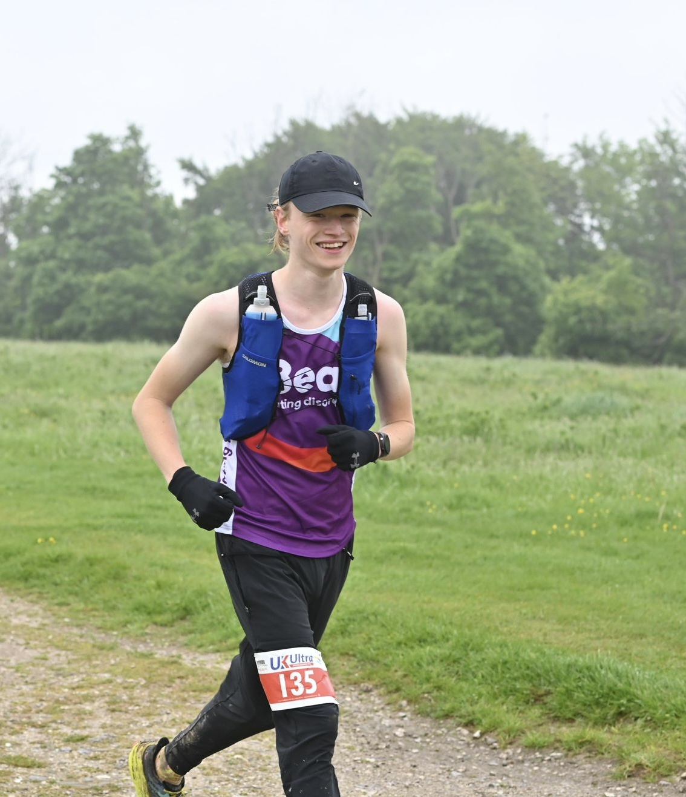

I am a 4th year pure maths student at University of St Andrews. I am very interested in geometric group theory, model theory, topology, and much more!

This website will house my papers and CV, as well as a blog. The blog will be about the maths I do, as well as things like PhD applications. 

Me!
